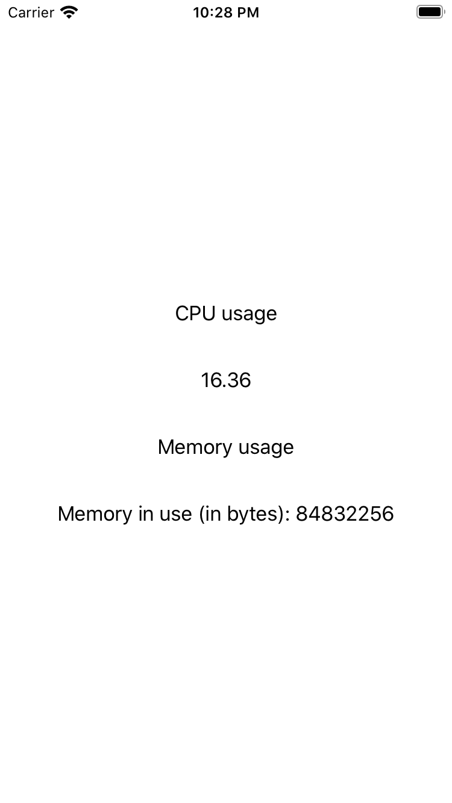

# ios-cpu-mem
Example app for get CPU and memory data

CPU usage is from
https://izziswift.com/get-cpu-usage-percentage-of-single-ios-app-in-swift-4-x/

Memory usage from
https://gist.github.com/pejalo/671dd2f67e3877b18c38c749742350ca
https://stackoverflow.com/questions/40991912/how-to-get-memory-usage-of-my-application-and-system-in-swift-by-programatically/40992791
